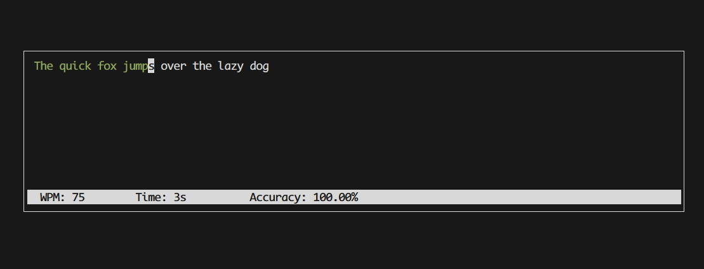

# typeclipy
## A lightweight command-line tool to practice typing with custom exercises



## Features
- Practice typing with random words or custom text
- Tracks typing speed and accuracy
- Fully offline, no internet needed

## Installation
```
pip install git+https://github.com/danilo-medeiros/typeclipy.git
```
Or clone and install editable version for development:
```
git clone https://github.com/danilo-medeiros/typeclipy.git
cd typeclipy
pip install -e .
```

## Usage

```bash
# Type random words
typeclipy

# Type custom text
typeclipy --text "Hello World" "Bye World"

# Type text from a file
typeclipy --file my_word_list.txt another_word_list.txt

# Pipe text from another command
echo "Hello World" | typeclipy

# Choose theme
typeclipy --theme light_beige
```

### Options:
- `--text <text> [...]`: List of texts to type
- `--file <file> [...]`: List of files to type
- `--minimal`: Hide final results and menu
- `--theme <theme>` Application theme. See `typeclipy --help` for options
- `--lang <en|pt>` Language of the random word list. English by default
- `--out <file path>` File to save the results
